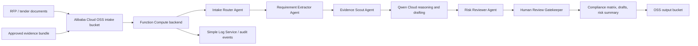

# BidPilot Qwen: Tender/RFP Autopilot Agent

BidPilot Qwen is a Qwen Cloud agent that turns long tender, RFP, RFQ, and security questionnaire documents into evidence-grounded compliance matrices, risk summaries, draft responses, and human review queues.

It is prepared for the Global AI Hackathon Series with Qwen Cloud.

Primary track: Track 4, Autopilot Agent.
Secondary fit: Track 3, Agent Society.

## Why This Fits Qwen Cloud

The hackathon asks builders to ship production-ready agents on Qwen Cloud. BidPilot Qwen targets a real business workflow: proposal teams need to extract mandatory requirements, find approved evidence, identify bid blockers, draft cited answers, and route risky commitments to humans before submitting a tender.

This is not a generic PDF chatbot. It is an end-to-end workflow with tool-like stages, persistent state, auditable outputs, and human checkpoints.

## What It Does

- Ingests an RFP, tender, RFQ, security questionnaire, or statement of work.
- Extracts mandatory clauses, deadlines, eligibility rules, evaluation criteria, response obligations, and disqualification risks.
- Searches approved company evidence before drafting any compliance claim.
- Uses Qwen Cloud for reasoning, classification, risk review, and answer drafting.
- Produces:
  - `requirements.json`
  - `compliance_matrix.csv`
  - `risk_summary.md`
  - `draft_responses.md`
  - `human_review_queue.md`
- Routes missing evidence, legal terms, pricing, certifications, delivery dates, low-confidence extraction, and disqualification risks to human review.

## Qwen And Alibaba Cloud Usage

The local demo runs without credentials using deterministic fallback logic. With `DASHSCOPE_API_KEY`, it can call Qwen Cloud's OpenAI-compatible Chat Completions API.

Default Qwen Cloud settings:

```text
QWEN_BASE_URL=https://dashscope-intl.aliyuncs.com/compatible-mode/v1
QWEN_MODEL=qwen3.7-plus
DASHSCOPE_API_KEY=your_key_here
```

Alibaba Cloud proof files:

- [`src/bidpilot_qwen/qwen_client.py`](./src/bidpilot_qwen/qwen_client.py) demonstrates the Qwen Cloud API call.
- [`src/bidpilot_qwen/alibaba_cloud_backend.py`](./src/bidpilot_qwen/alibaba_cloud_backend.py) provides a Function Compute style handler.
- [`infra/alibaba-cloud/serverless-devs.yaml`](./infra/alibaba-cloud/serverless-devs.yaml) sketches deployment to Alibaba Cloud Function Compute with OSS-backed artifact storage.

## Quick Start

Run the deterministic demo:

```bash
python3 examples/run_demo.py
```

Run with Qwen Cloud enabled:

```bash
export DASHSCOPE_API_KEY="your-qwen-cloud-key"
export QWEN_MODEL="qwen3.7-plus"
python3 examples/run_demo.py --qwen
```

The demo writes sample artifacts into `examples/expected-outputs/`.

## Architecture



See [`docs/architecture.md`](./docs/architecture.md) for the full workflow.

## Repository Structure

```text
.
|-- README.md
|-- prompt.md
|-- submission.md
|-- docs/
|   |-- architecture.md
|   |-- deployment-proof.md
|   |-- judging-criteria.md
|   |-- qwen-rules-alignment.md
|   `-- video-script.md
|-- examples/
|   |-- run_demo.py
|   |-- sample-input.md
|   `-- expected-outputs/
|-- infra/
|   `-- alibaba-cloud/
|       `-- serverless-devs.yaml
|-- schema/
|   `-- requirement.schema.json
|-- src/
|   `-- bidpilot_qwen/
|       |-- __init__.py
|       |-- alibaba_cloud_backend.py
|       |-- models.py
|       |-- qwen_client.py
|       `-- workflow.py
`-- tests/
    `-- test_workflow.py
```

## Safety Rules

- Never claim compliance without approved evidence.
- Every extracted requirement must keep source document and section metadata.
- Missing evidence for a mandatory requirement is a blocker.
- Legal, pricing, SLA, certification, delivery date, and bid/no-bid decisions require a named human owner.
- Sensitive customer or government documents must not be processed until data classification, retention, and deletion policies are defined.
- API keys and Alibaba Cloud credentials must live in environment variables or managed secrets, never in code.

## Validation

```bash
python3 -m compileall src examples tests
python3 examples/run_demo.py
python3 -m unittest discover -s tests
```

## License

MIT License. See [`LICENSE`](./LICENSE).
