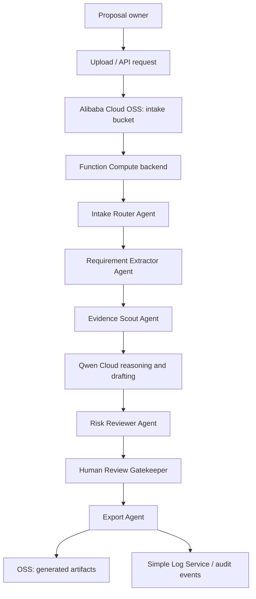

# Architecture

BidPilot Qwen is designed as a production-oriented Qwen Cloud Autopilot Agent for proposal compliance workflows.

## System Diagram

## Workflow

1. Intake Router Agent receives an opportunity package and identifies document type, opportunity ID, language, and missing metadata.
2. Requirement Extractor Agent extracts requirements, deadlines, mandatory clauses, evaluation criteria, response obligations, and disqualification risks.
3. Evidence Scout Agent searches approved company evidence and tags each requirement as supported, partial, stale, or missing.
4. Qwen Cloud reasoning synthesizes risk labels, owner roles, draft responses, and reviewer instructions.
5. Risk Reviewer Agent checks for unsafe claims, legal/pricing/certification/SLA/delivery commitments, and low confidence.
6. Human Review Gatekeeper blocks claims that need accountable approval.
7. Export Agent writes structured outputs to JSON, CSV, and Markdown.

## Alibaba Cloud Service Mapping

| Layer | Service | Purpose |
| --- | --- | --- |
| Model reasoning | Qwen Cloud / DashScope-compatible API | Classification, risk analysis, response drafting, review synthesis |
| Backend compute | Alibaba Cloud Function Compute | Stateless workflow endpoint and demo backend |
| Artifact storage | Alibaba Cloud OSS | Input documents and generated outputs |
| Logs | Simple Log Service | Execution logs, audit-friendly events, error diagnostics |
| Secrets | Alibaba Cloud KMS or environment variables | API keys and service credentials |
| Future state store | Table Store or ApsaraDB RDS | Opportunity metadata, requirement records, review tasks |
| Future retrieval | OpenSearch or vector database | Evidence search over company documents |

## Agent Tools

The prototype models these tools as deterministic functions that can later be exposed as Qwen tool calls or MCP tools:

- `parse_rfp_text`
- `extract_requirements`
- `search_approved_evidence`
- `score_risk`
- `draft_from_evidence`
- `create_human_review_task`
- `export_artifacts`

## Human-In-The-Loop Gates

The workflow creates review tasks when:

- evidence is missing for a mandatory requirement
- the requirement concerns legal, pricing, certification, SLA, delivery date, data residency, or disqualification risk
- extraction confidence is below the configured threshold
- retrieved evidence is stale or partial
- the model and deterministic checker disagree

## Production Hardening

Before production use, add:

- PDF/DOCX/XLSX parsing
- persistent requirement database
- authenticated reviewer UI
- role-based access controls
- document retention and deletion workflows
- audit log export
- observability dashboards
- evidence index refresh jobs
- red-team tests for hallucinated compliance claims
